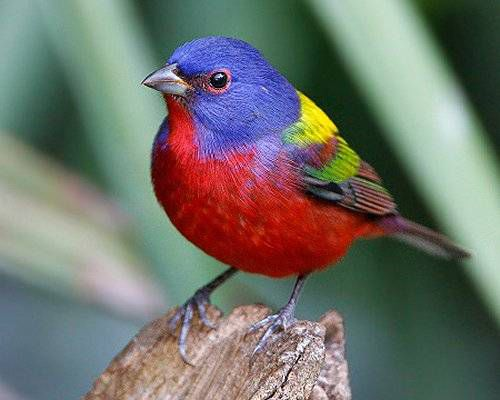
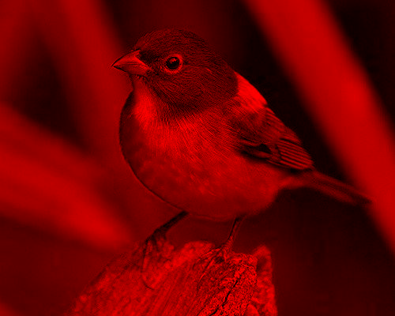
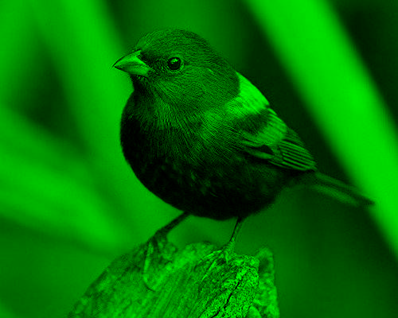
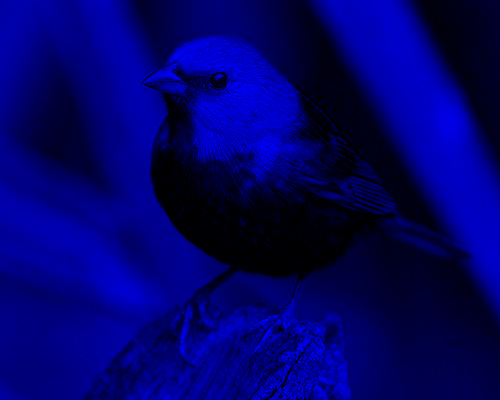
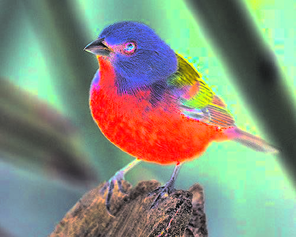
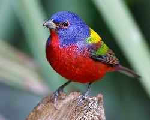

# Лабораторная работа №1

## Цветовые модели и передискретизация

Исходное изображение:

---

## 1. Цветовые модели

### 1.1 Компонента R

### 1.2 Компонента G

### 1.3 Компонента B

### 1.4 Яркостная компонента I (HSI)

### 1.5 Инверсия яркостной компоненты I

---

## 2. Передискретизация

### 2.1 Растяжение (интерполяция) в 3 раза

### 2.2 Сжатие (децимация) в 2 раза

### 2.3 Передискретизация K = 3/2 в два прохода

### 2.4 Передискретизация K = 3/2 за один проход

