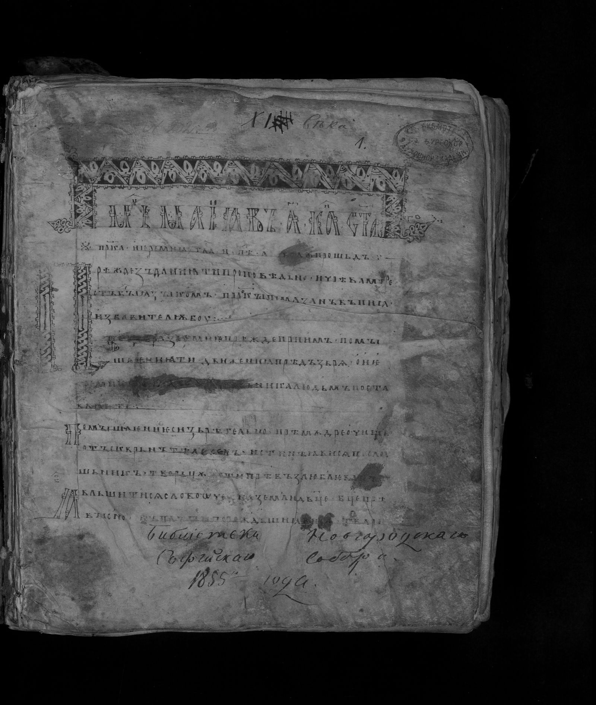
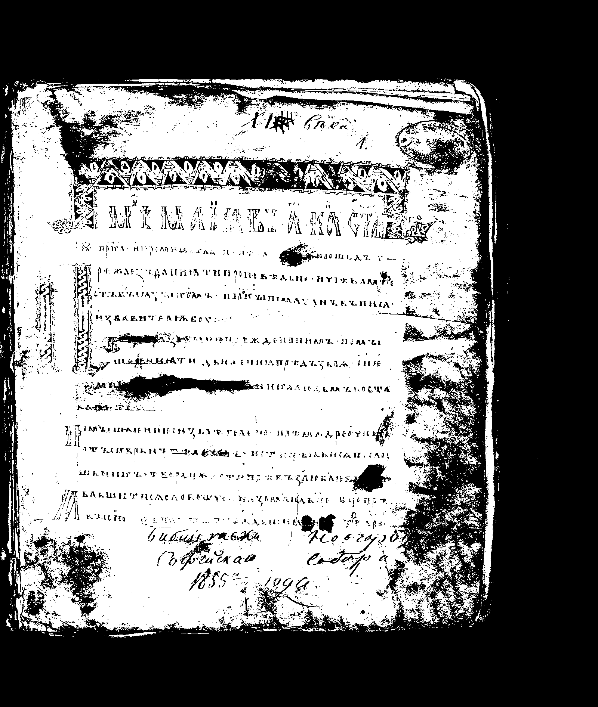

# Лабораторная работа №2

## Обесцвечивание и бинаризация растровых изображений

---

## Задание 1. Приведение к полутоновому изображению

Для перевода RGB-изображения в градации серого использовалась формула:

```text
Y = 0.3R + 0.59G + 0.11B
```

Сформированные полутоновые изображения сохранены в формате BMP.

---

## Результаты (полутон)

### Изображение 1

**До обработки:**


**После обесцвечивания:**


### Изображение 2

**До обработки:**


**После обесцвечивания:**


### Изображение 3

**До обработки:**


**После обесцвечивания:**



---

## Задание 2. Бинаризация изображения

Для бинаризации использовался метод балансировки гистограммы (Balanced Histogram Thresholding).

Кратко по шагам:

1. Строится гистограмма яркости полутонового изображения.
2. Находятся левый и правый края ненулевых значений.
3. "Весы" слева и справа балансируются накоплением пикселей.
4. В точке баланса определяется порог `T`.
5. Выполняется бинаризация по правилу: `gray > T -> 255`, иначе `0`.

Полученные пороги:

- `img_0001.bmp`: `T = 105`
- `img_0002.bmp`: `T = 120`
- `img_0003.bmp`: `T = 85`

---

## Результаты (бинаризация)

### Изображение 1

**Полутоновое:**


**Бинаризованное:**


### Изображение 2

**Полутоновое:**


**Бинаризованное:**


### Изображение 3

**Полутоновое:**


**Бинаризованное:**



