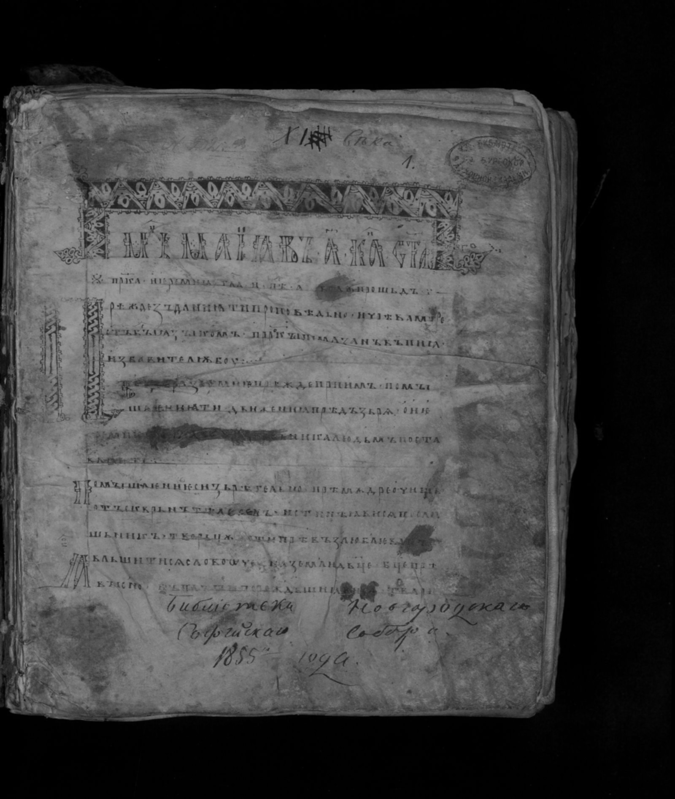
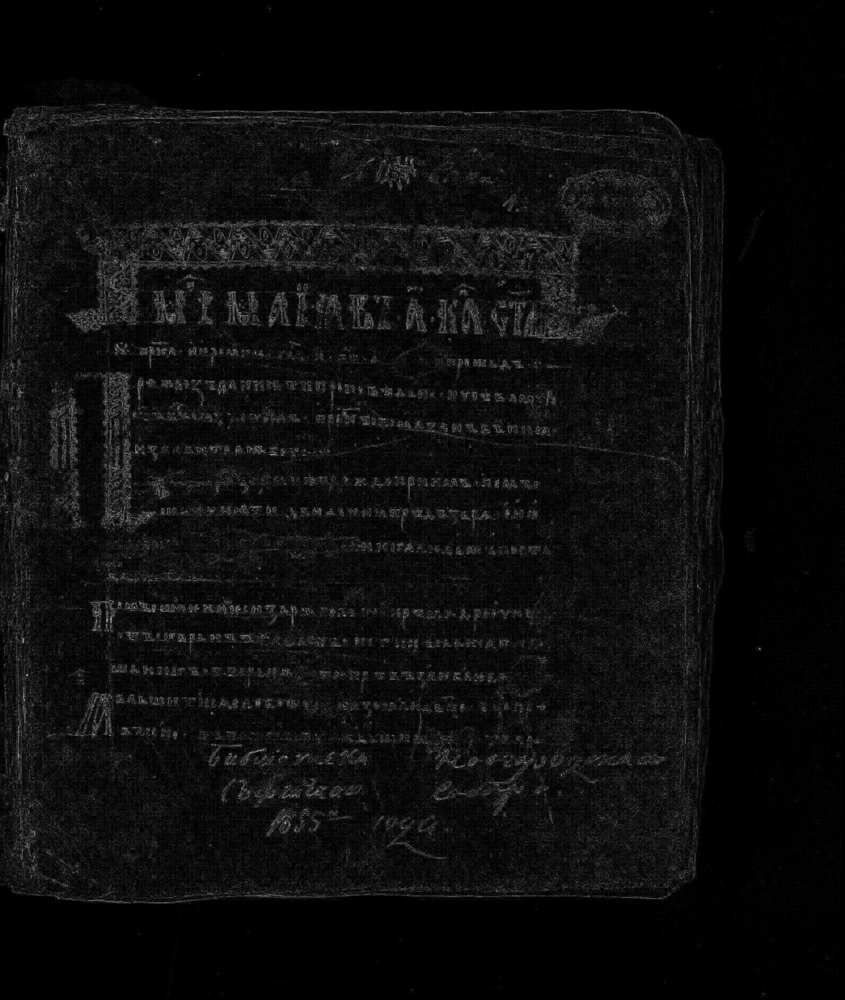

# Лабораторная работа №3

## Фильтрация изображений и морфологические операции

**Вариант:** 1  
**Метод:** пространственное сглаживание  
**Окно:** 3x3

---

## Используемый метод

Для каждого пикселя полутонового изображения вычислялось среднее значение яркости в окрестности `3x3`:

```text
g(x, y) = (1/9) * sum(f(x + i, y + j)), i, j in {-1, 0, 1}
```

Границы обрабатывались расширением изображения по краю (повтор крайних пикселей).

---

## Разностное изображение

В соответствии с условием для полутонового изображения использовался модуль разности:

```text
diff = |filtered - original|
```

Так как разность для части изображений была визуально очень тёмной, выполнено дополнительное контрастирование:

- для `img_0001` и `img_0002`: умножение `diff` на `10`;
- для `img_0003`: умножение `diff` на `5`.

---

## Результаты

### Изображение 1

**Исходное:**


**После фильтрации (3x3):**


**Разностное (|filtered-original|, x10):**


### Изображение 2

**Исходное:**


**После фильтрации (3x3):**


**Разностное (|filtered-original|, x10):**


### Изображение 3

**Исходное:**


**После фильтрации (3x3):**



**Разностное (|filtered-original|, x5):**



