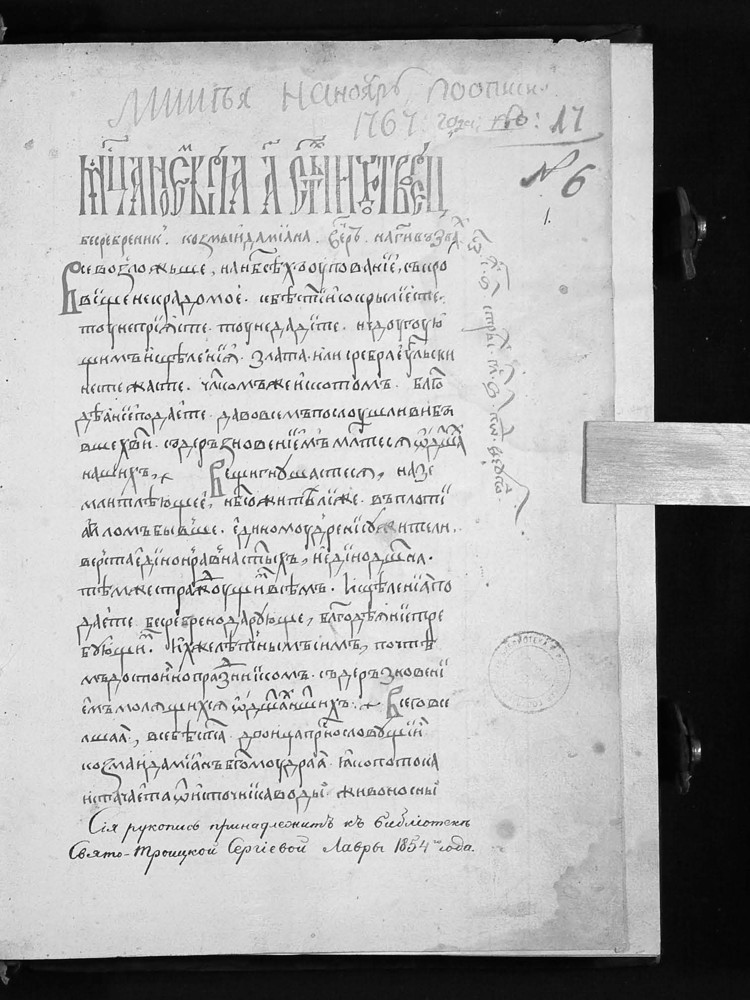
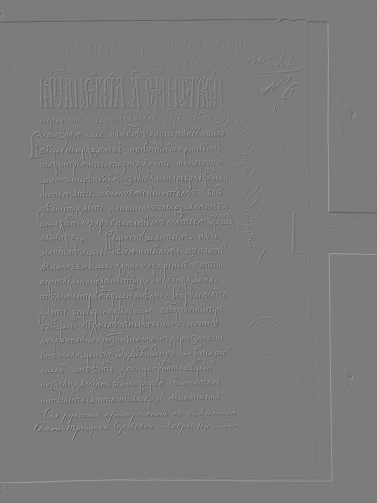
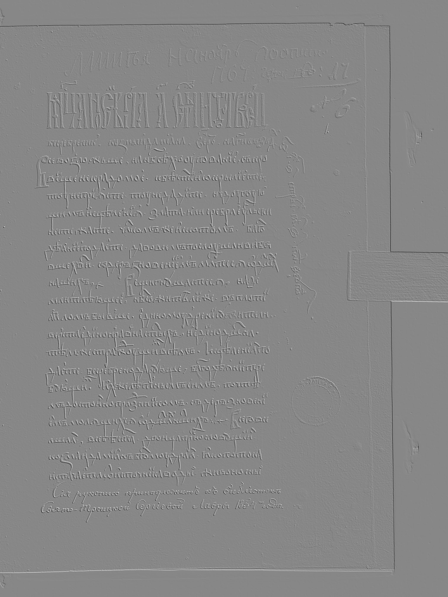
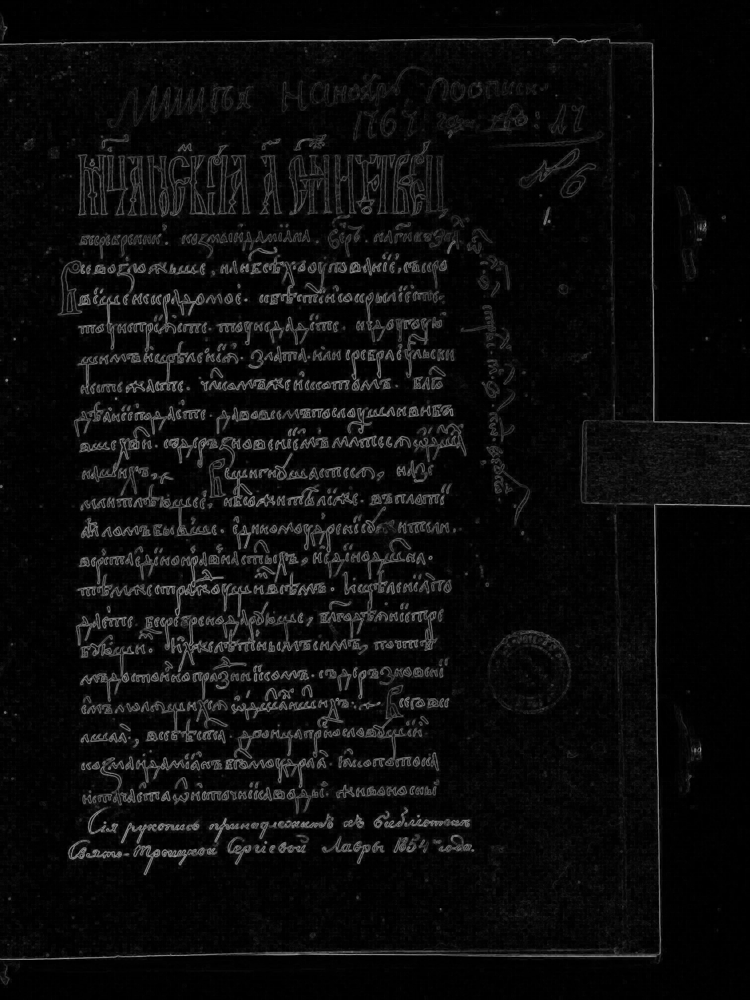
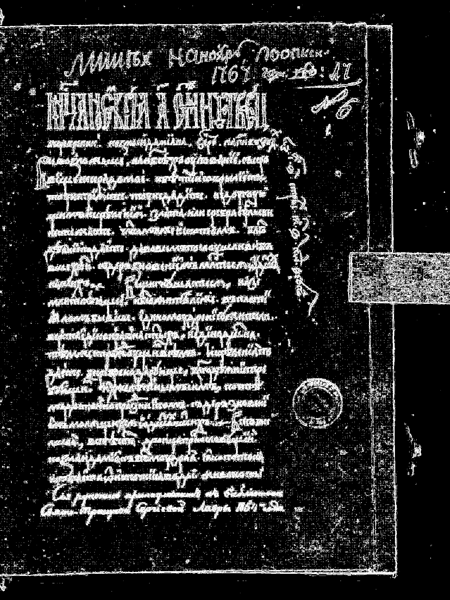
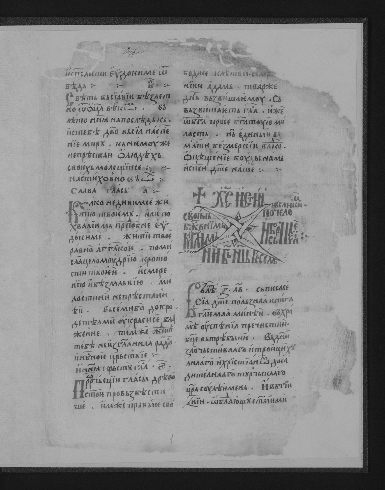
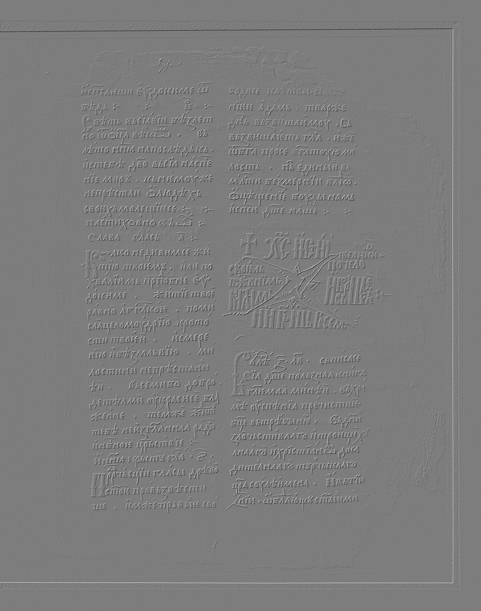
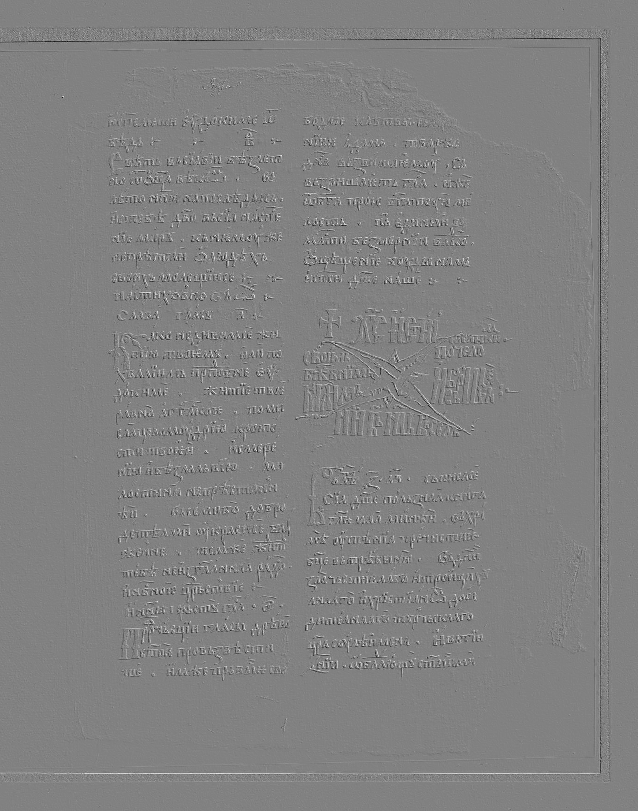
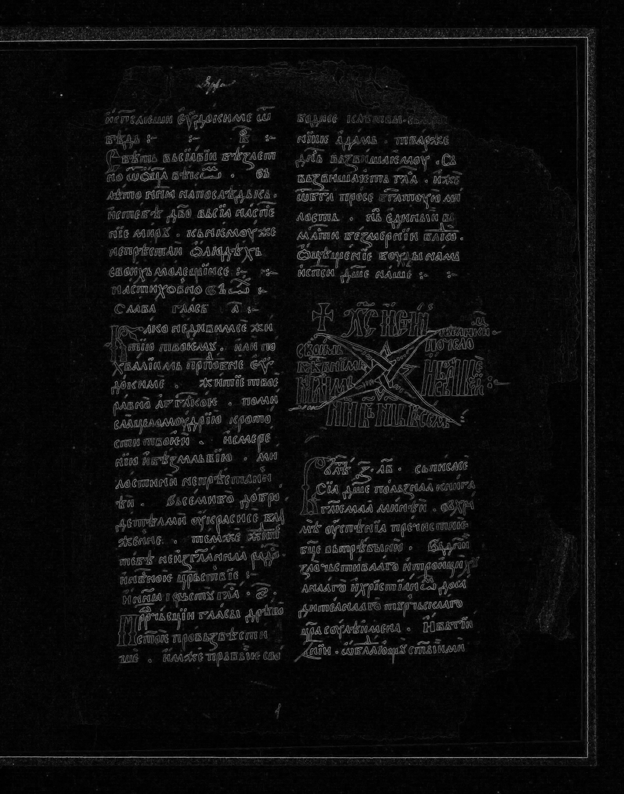
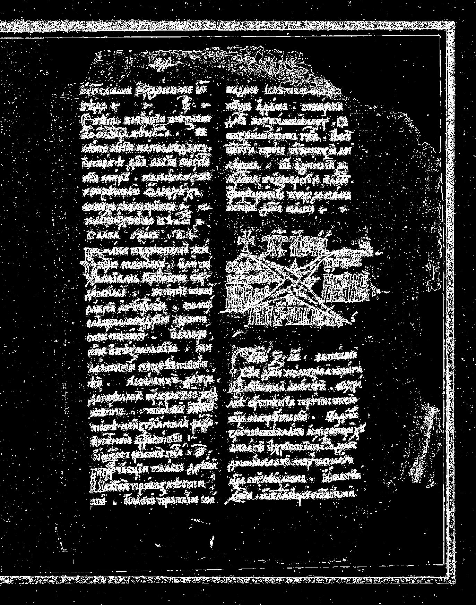

# Лабораторная работа №4

## Выделение контуров на изображении

**Вариант:** 1  
**Оператор:** Робертса (2x2)  
**Изображения выборки:** №4, №9, №10

---

## Используемый метод

Для каждого изображения выполнялись шаги:

1. Исходное цветное изображение переводилось в полутоновое по формуле:

```text
Y = 0.3R + 0.59G + 0.11B
```

2. Вычислялись компоненты градиента оператора Робертса (вариант 1):

```text
Gx = e - i
Gy = f - h
G  = sqrt(Gx^2 + Gy^2)
```

3. Матрицы `Gx`, `Gy`, `G` нормализовались в диапазон `[0..255]`.
4. Матрица `G` бинаризовалась по эмпирически подобранному порогу `T`.

Использованные пороги:

- `img_0004`: `T = 13`
- `img_0009`: `T = 8`
- `img_0010`: `T = 15`

---

## Результаты

### Изображение №4 (`img_0004`)

**Исходное цветное:**


**Полутоновое:**



**Градиент `Gx` (нормированный):**



**Градиент `Gy` (нормированный):**



**Модуль градиента `G` (нормированный):**



**Бинаризованная матрица `G`:**



### Изображение №9 (`img_0009`)

**Исходное цветное:**


**Полутоновое:**


**Градиент `Gx` (нормированный):**


**Градиент `Gy` (нормированный):**


**Модуль градиента `G` (нормированный):**


**Бинаризованная матрица `G`:**


### Изображение №10 (`img_0010`)

**Исходное цветное:**


**Полутоновое:**



**Градиент `Gx` (нормированный):**



**Градиент `Gy` (нормированный):**



**Модуль градиента `G` (нормированный):**



**Бинаризованная матрица `G`:**


